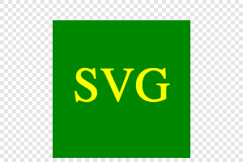

# challenge-10-svg-logo-maker

## Description

In this challenge I was prompted to create a application that will generate a logo. This challenge is a command-line application that accepts user input. When the user is prompted what shape they want their logo to be. They are given a list of 3 shapes, circle, square, triangle. When the user is prompted what color they want their logo to be they are able to type in a color, or use a hexadecimal number. They are able to do the same for the text color question. Finally they are prompted with the question of what they want their text to be. The user is able to type up to 3 letters for the response. When all the propted questions are answered, a SVG file is created named logo.svg and the text "Successfully created logo.svg" is printed in the command line. They the user is able to open that file in the command line and the user is then presented with a 300x22 pixle image that matches the criteria they entered. 

There were also tests that were ran to ensure the color that was inputed for the shape color properly worked. In the demostration video you can see that all tests were passed.

## Installation

Node.js and inquirer needs to be installed to allow this application to work. To test this application, you will need jest to be installed to run the test.

## Usage

This application is a great tool for a developer to generate a personally logo for any project that they work on. This is a great tool to save money so you do not have to got to a graphic designer. You can simply generate a logo with this application and use it for any of your projects. 

## Credits

N/A

## License

Please refer to the LICENSE in the repo